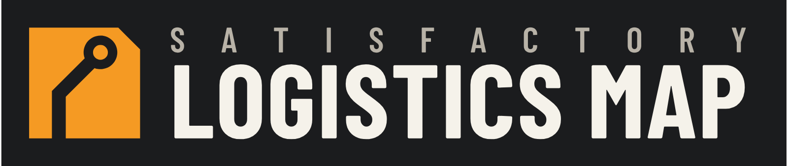

<p align="center"></p>

# Satisfactory Logistics Map — deutsche Kurzfassung

Die vollständige Dokumentation ist englisch: [README.md](README.md) und das
[Wiki](https://github.com/Fade97/satisfactory-logistics-map/wiki).

Web-Karte für einen eigenen Satisfactory-Dedicated-Server. Sie liest den Spielstand und zeigt, was in der Fabrik los ist,
am PC, auf dem zweiten Monitor oder am Handy. Die Oberfläche ist standardmäßig englisch und lässt sich unter
**Meine Ansicht → Sprache** (englisch: *My view → Language*) auf Deutsch umstellen. Warennamen sind wahlweise englisch oder deutsch.

- **Lage** (`#/overview`): was gerade klemmt, Mangelware, was seit dem letzten Besuch passiert ist
- **Karte** (`#/map`): Stationen, Züge, LKW, Spieler (Folge-Modus), Gleise/Bänder/Rohre, Fundamente, Heatmap stehender Maschinen,
  Warenfluss je Ware, Sammelobjekte, Höhenfilter, Messen, Notizen, Zeitreise der letzten 24 h
- **Produktion** (`#/production`): Warenbilanz, Fabriken (automatisch über das Bandnetz erkannt), stehende Maschinen mit Grund, 3D-Ansicht je Fabrik
- **Strom** (`#/power`): Netze, Auslastung, Brennstoff-Reichweite, Maschinen ohne Stromanschluss
- **Logistik** (`#/logistics`): Füllstände, Zug- und LKW-Durchsatz, Fahrplan-Prüfung, Lager, AWESOME Sink
- **Verlauf** (`#/history`): Produktion und Strom über Stunden bis Monate, Änderungsprotokoll
- **Rechner** (`#/planner`): Produktionsketten nur mit freigeschalteten Rezepten, Überschüsse nutzen, Bauplatz, Blueprint-Export (experimentell)
- Installierbar als App (PWA), Kiosk-Modus für einen Nebenbildschirm (`#/kiosk?follow=<Spieler>&rotate=30`)

Die Adressen sind englisch; alte deutsche Adressen (`#/karte`, `?ware=`, `?folge=` …) funktionieren weiter.

Ohne Mod läuft alles aus dem Save, im Autosave-Takt (meist 5 min). Mit dem optionalen Mod
[FicsIt Remote Monitoring](docs/FRM.md) kommen Positionen alle 5 s und Maschinen und Strom jede Minute.

## Schnellstart mit Docker

```sh
git clone https://github.com/Fade97/satisfactory-logistics-map.git
cd satisfactory-logistics-map
cp .env.example .env        # Save-Quelle eintragen, siehe unten
docker compose up -d        # baut das Image beim ersten Start
```

Danach http://localhost:8050 öffnen. Solange noch kein Save da ist, zeigt die Seite oben den Grund an,
zum Beispiel falsches Passwort oder Ordner nicht gefunden. Der nächste Versuch läuft automatisch nach einer Minute.

## Save-Quelle wählen (`SAVE_SOURCE`)

| Variante | `SAVE_SOURCE` | Wann |
|---|---|---|
| **Server-API** | `api://server:7777` + `SAVE_PASSWORD` (Admin-Passwort) | Am einfachsten, geht bei jedem Dedicated Server und braucht nur Adresse und Admin-Passwort. Liest das jüngste Save der laufenden Session, ohne ein neues anzulegen. |
| **SFTP** | `sftp://user@host:2022/pfad` + `SAVE_PASSWORD` oder `SAVE_KEY` | Pterodactyl (Port 2022, Benutzer `<panelname>.<server-id>`, Pfad `/.config/Epic/FactoryGame/Saved/SaveGames/server`) oder eigener Linux-Server |
| **FTP/FTPS** | `ftp://…` / `ftps://user@host/pfad` + `SAVE_PASSWORD` | viele Server-Hoster |
| **Ordner** | `/saves` (Volume in `docker-compose.yml` einhängen) | Gameserver läuft auf demselben Rechner |
| *(leer)* | – | `*.sav` von Hand in das Datenvolume unter `saves/` legen |

Genommen wird das jüngste `*.sav`; mehrere Sessions im Ordner lassen sich mit `SAVE_PATTERN=Session_*.sav` eingrenzen.
Alle weiteren Einstellungen (`FRM_URL`, `MAP_PIN_PASSWORD`, `MAP_TITLE`, `MAP_DATA`, `TZ`) stehen in
[README.md](README.md#settings) und in `.env.example`.

**Öffentlich erreichbar machen:** hinter einen Reverse Proxy mit HTTPS stellen, zum Beispiel Traefik, Caddy oder nginx.
Lesen ist offen. Schreiben verlangt das Passwort, nach 10 Fehlversuchen ist die IP 10 Minuten gesperrt.
Den FRM-Port nicht öffentlich freigeben.

## Lizenz

Code unter [MIT](LICENSE). Mitgelieferte Daten fremder Projekte haben eigene Lizenzen, siehe [THIRD_PARTY.md](THIRD_PARTY.md).
Die Kartengrafik steht unter CC BY-NC-SA und darf nicht kommerziell genutzt werden.
Kein offizielles Projekt; Satisfactory ist eine Marke von Coffee Stain Studios.
