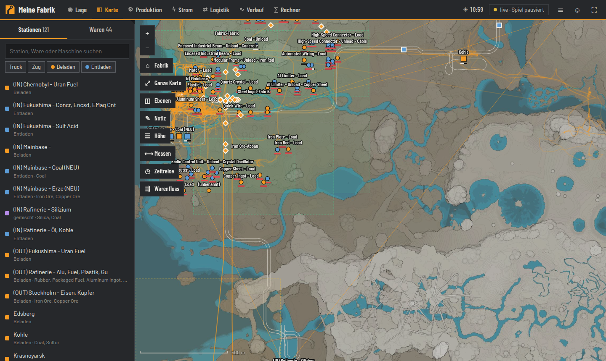
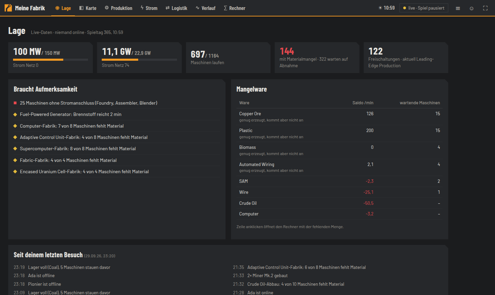
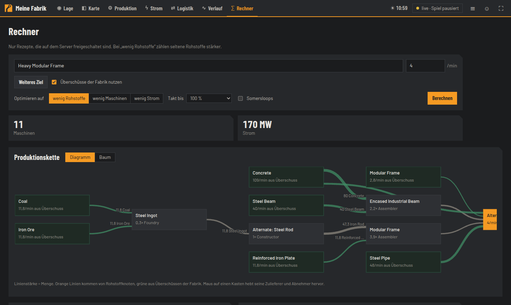

<p align="center"></p>

<p align="center">
  <a href="https://github.com/Fade97/satisfactory-logistikkarte/actions/workflows/ci.yml"></a>
  <a href="LICENSE"></a>
  <a href="https://github.com/Fade97/satisfactory-logistikkarte/wiki"></a>
</p>

# Satisfactory-Logistikkarte

Web-Karte für einen eigenen Satisfactory-Dedicated-Server. Sie liest den Spielstand und zeigt, was in der Fabrik los ist,
am PC, auf dem zweiten Monitor oder am Handy. Die Oberfläche ist auf Deutsch, Warennamen sind wahlweise englisch oder deutsch.

- **Lage**: was gerade klemmt, Mangelware, was seit dem letzten Besuch passiert ist
- **Karte**: Stationen, Züge, LKW, Spieler (Folge-Modus), Gleise/Bänder/Rohre, Fundamente, Heatmap stehender Maschinen,
  Warenfluss je Ware, Sammelobjekte, Höhenfilter, Messen, Notizen, Zeitreise der letzten 24 h
- **Produktion**: Warenbilanz, Fabriken (automatisch über das Bandnetz erkannt), stehende Maschinen mit Grund, 3D-Ansicht je Fabrik
- **Strom**: Netze, Auslastung, Brennstoff-Reichweite, Maschinen ohne Stromanschluss
- **Logistik**: Füllstände, Zug- und LKW-Durchsatz, Fahrplan-Prüfung, Lager, AWESOME Sink
- **Verlauf**: Produktion und Strom über Stunden bis Monate, Änderungsprotokoll
- **Rechner**: Produktionsketten nur mit freigeschalteten Rezepten, Überschüsse nutzen, Bauplatz, Blueprint-Export (experimentell)
- Installierbar als App (PWA), Kiosk-Modus für einen Nebenbildschirm (`#/kiosk?folge=<Spieler>&rotate=30`)



<p> </p>

Ohne Mod läuft alles aus dem Save, im Autosave-Takt (meist 5 min). Mit dem optionalen Mod
[FicsIt Remote Monitoring](docs/FRM.md) kommen Positionen alle 5 s und Maschinen und Strom jede Minute.

**Ausführliche Anleitungen im [Wiki](https://github.com/Fade97/satisfactory-logistikkarte/wiki)**: Installation,
Save-Quelle je Server-Typ, Live-Daten, Reverse Proxy, How-tos, Fehlerbehebung, API.

## Schnellstart mit Docker

```sh
git clone https://github.com/Fade97/satisfactory-logistikkarte.git
cd satisfactory-logistikkarte
cp .env.example .env        # Save-Quelle eintragen, siehe unten
docker compose up -d        # baut das Image beim ersten Start
```

Danach http://localhost:8050 öffnen. Solange noch kein Save da ist, zeigt die Seite oben den Grund an,
zum Beispiel falsches Passwort oder Ordner nicht gefunden. Der nächste Versuch läuft automatisch nach einer Minute.

## Save-Quelle wählen (`SAVE_SOURCE`)

| Variante | `SAVE_SOURCE` | Wann |
|---|---|---|
| **Server-API** | `api://server:7777` + `SAVE_PASSWORD` (Admin-Passwort) | Am einfachsten, geht bei jedem Dedicated Server und braucht nur Adresse und Admin-Passwort. Liest das jüngste Save der laufenden Session, ohne ein neues anzulegen. |
| **SFTP** | `sftp://user@host:2022/pfad` + `SAVE_PASSWORD` oder `SAVE_KEY` | Pterodactyl (Port 2022, Benutzer `<panelname>.<server-id>`, Pfad `/.config/Epic/FactoryGame/Saved/SaveGames/server`) oder eigener Linux-Server |
| **FTP/FTPS** | `ftp://…` / `ftps://user@host/pfad` + `SAVE_PASSWORD` | viele Server-Hoster |
| **Ordner** | `/saves` (Volume in `docker-compose.yml` einhängen) | Gameserver läuft auf demselben Rechner |
| *(leer)* | – | `*.sav` von Hand in das Datenvolume unter `saves/` legen |

Typische Save-Ordner: Linux-Server `~/.config/Epic/FactoryGame/Saved/SaveGames/server/`,
Windows-Server `%LOCALAPPDATA%\FactoryGame\Saved\SaveGames\server\`. Genommen wird das jüngste `*.sav`.
Mehrere Sessions im Ordner lassen sich mit `SAVE_PATTERN=Session_*.sav` eingrenzen.
Geladen wird nur, wenn sich das Save geändert hat. Der Abruf läuft jede Minute.

## Einstellungen

| Variable | Standard | Bedeutung |
|---|---|---|
| `SAVE_SOURCE` | *(leer = `saves/`)* | siehe oben |
| `SAVE_PASSWORD` / `SAVE_TOKEN` / `SAVE_KEY` | – | Zugang zur Save-Quelle; ein Sonderzeichen im Passwort ist hier unkritischer als in der URL |
| `SAVE_PATTERN` | `*.sav` | Dateimuster |
| `FRM_URL` | *(leer = aus)* | FicsIt Remote Monitoring, z. B. `http://server:8080`, siehe [docs/FRM.md](docs/FRM.md) |
| `MAP_PIN_PASSWORD` | *(leer = nur lesen)* | gemeinsames Passwort für Notizen, Fabriknamen und -status |
| `MAP_TITLE` | Sessionname | Name oben links |
| `MAP_DATA` | `data/` (`/data` im Container) | Verlauf (SQLite), Notizen, erzeugte Blueprints |
| `TZ` | `Europe/Berlin` (Container) | Zeitzone für Zeitangaben |

**Öffentlich erreichbar machen:** hinter einen Reverse Proxy mit HTTPS stellen, zum Beispiel Traefik, Caddy oder nginx.
Lesen ist offen. Schreiben verlangt das Passwort, nach 10 Fehlversuchen ist die IP 10 Minuten gesperrt.
Den FRM-Port nicht öffentlich freigeben.

## Ohne Docker

```sh
python3 -m venv .venv && .venv/bin/pip install -r requirements.txt
cd frontend && pnpm install && pnpm run build && cd ..
SAVE_SOURCE=/pfad/zu/SaveGames/server .venv/bin/python mapd.py --port 8050
```

Für den Dauerbetrieb eignet sich ein systemd-Dienst mit denselben Umgebungsvariablen (`Environment=` bzw. `EnvironmentFile=`).

## Entwicklung

```sh
.venv/bin/pip install -r requirements-dev.txt
make test       # pytest (tests/) + vitest (frontend/tests/)
make check      # dazu Typprüfung, Build und Rauchtest aller Seiten gegen :8050 (Desktop + Handy)
cd frontend && pnpm dev   # Vite mit Proxy auf den laufenden Dienst
```

Die Save-Tests brauchen `tests/fixtures/sample.sav`, eine beliebige Kopie eines Saves. Die Datei liegt nicht im Repo,
und die festen Zahlen in `tests/test_backend.py` gelten nur für das ursprüngliche Save. Die Tests der Save-Quellen
(`tests/test_source.py`) laufen ohne Fixture.

## Aufbau

| Teil | Aufgabe |
|---|---|
| `mapd.py` | Einstieg: ein Dienst mit drei Takten (live 5 s, Fabrik 60 s, Save 60 s), liefert `frontend/dist` und `/api/*` |
| `mapsvc/` | `core` (Zustand, Konfiguration), `source` (Save-Quellen), `collect` (Takte), `factory` (Bilanz, Fabrik-Erkennung), `events`, `logistics` (Durchsatz, Fahrplan), `planner`, `http` |
| `sav.py`, `sbp.py` | Save- und Blueprint-Format (UE 5.4+ Property-Tags), siehe [docs/BLUEPRINTS.md](docs/BLUEPRINTS.md) |
| `factory.py` | Fabrik aus dem Save: Maschinen, Rezepte, Raten, Stromnetze, Bänder, Warenfluss, Sammelobjekte, Lager |
| `stations.py`, `lightweight.py` | Stationen, Fahrpläne, Fahrzeuge; Fundamente und Wände (Leichtbau-Objekte) |
| `planner.py` | Produktionsrechner (lineares Programm, scipy/HiGHS) |
| `store.py` | SQLite: Zeitreihen (Minute 48 h → Stunde 90 Tage → Tag), Ereignisse, Spuren, Notizen |
| `frm.py`, `geo.py` | Client für FicsIt Remote Monitoring |
| `frontend/` | Svelte 5 + Vite, eigene Canvas-Karte (`lib/mapview.ts`), three.js für 3D |
| `gamedata/` | Rezepte, Rohstoffknoten, Rezeptpfade, Blueprint-Vorlagen |
| `blueprints/`, `gen.py`, `bpgen.py` | Bahn-Set-Blueprints und Generator |
| `tools/` | `install_frm_pterodactyl.sh`: SML + FRM auf einen Pterodactyl-Server bringen |
| `docs/` | [DESIGN](docs/DESIGN.md) (Gestaltung), [FRM](docs/FRM.md), [BLUEPRINTS](docs/BLUEPRINTS.md), [ROADMAP](ROADMAP.md) |

## Lizenz

Code unter [MIT](LICENSE). Mitgelieferte Daten fremder Projekte haben eigene Lizenzen, siehe [THIRD_PARTY.md](THIRD_PARTY.md).
Die Kartengrafik steht unter CC BY-NC-SA und darf nicht kommerziell genutzt werden.
Kein offizielles Projekt; Satisfactory ist eine Marke von Coffee Stain Studios.
